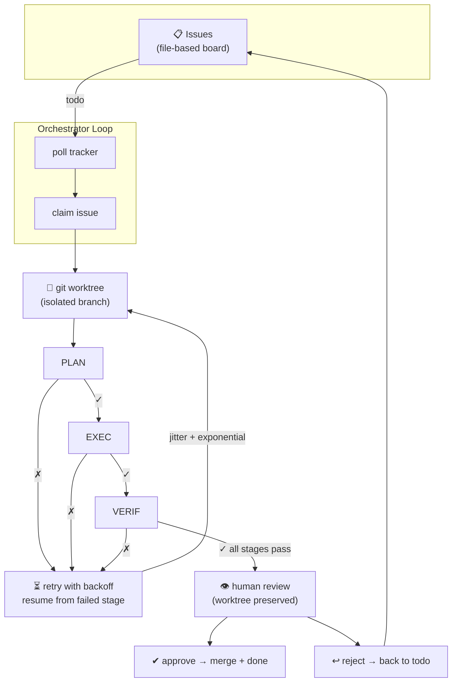
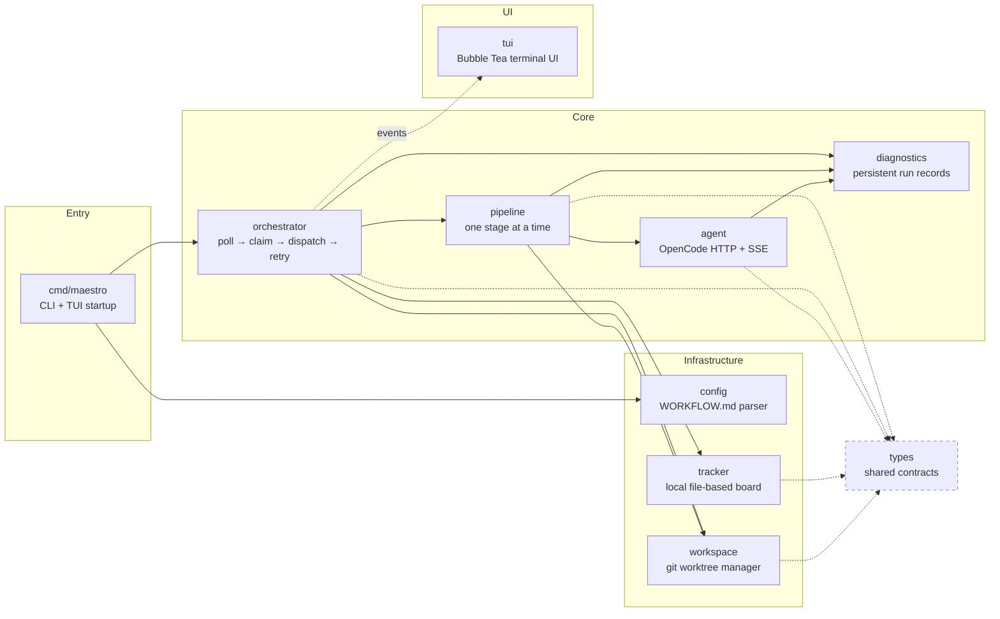
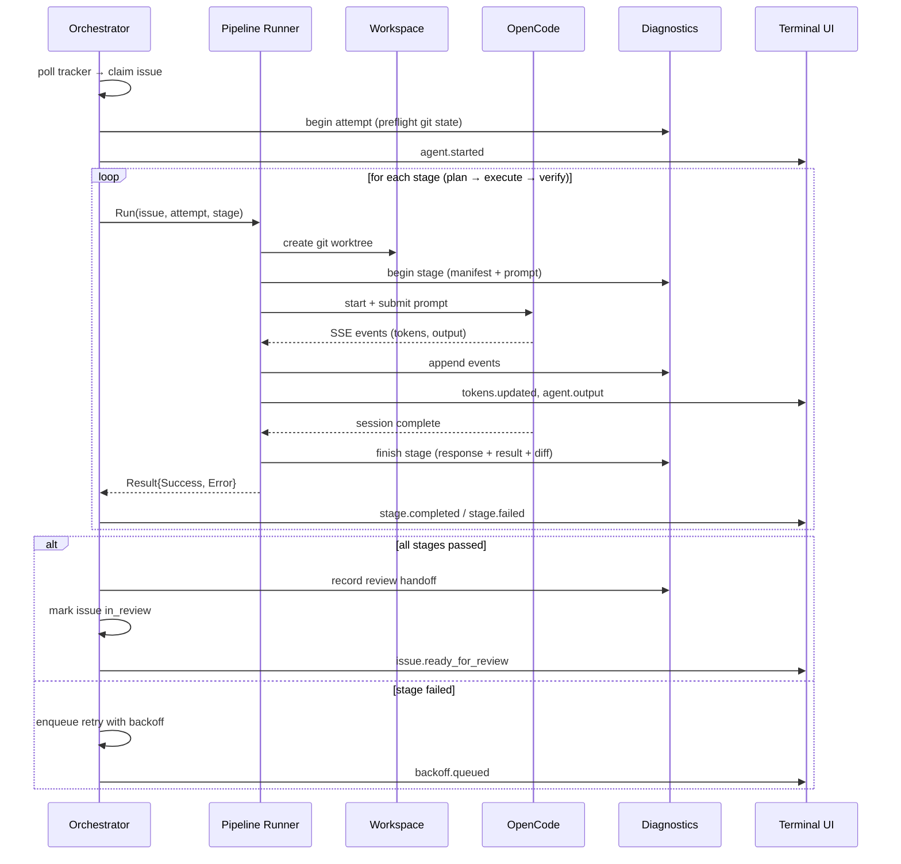

# Maestro Diagrams

## How It Works — The Pipeline Lifecycle

**Key points:**

- **Stage-scoped retry.** If `verify` fails, only `verify` is retried — not `plan` or `execute`.
- **Exponential backoff** with ±20% jitter, capped at 4 minutes.
- **No auto-merge.** On success, the issue enters `in_review`. A human inspects the worktree, then approves or rejects.
- **Everything is persisted.** Every stage writes prompt, response, diff, and result to `.maestro/runs/`.

---

## Architecture — How Packages Connect

**Dependency rule:** `types` has zero internal dependencies — everything depends on it. Each other package depends only on what's below it in the stack: `config → tracker → workspace → agent → diagnostics → pipeline → orchestrator → tui`.

---

## Data Flow — One Attempt

